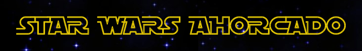

# Este repositorio contiene el Juego del Ahorcado desarrollado en Python

Este juego es el resultado del proyecto del Módulo-1 de la Promo-B-da-pt de Adalab. 
El nombre de nuestra promo es Blasco, en referencia a María Blasco directora del CNIO

Se ha escogido una temática Star Wars para el juego y se han desarrollado dos versiones, una sencilla sin interfaz gráfica y otra más completa con interfaz.

Las reglas del juego son las habituales:
- Adivinar la palabra secreta proponiendo letras
- Si se acierta una letra se actualiza el tablero con la letra en su posición en la palabra
- El juego admite hasta 6 fallos, por cada fallo se añade una parte a la figura del ahorcado (la cabeza, el cuerpo, los dos brazos y las dos piernas).

## Autoras

- Nerea Rial Conde
[@nerearial] (https://github.com/nerearial)
- Belén Vargas Navarro
[@BelenVN] (https://github.com/BelenVN)
- Luz Marina Hernández García
[@luzmarinahg] (https://github.com/luzmarinahg)
- Elena Fernandez Burguera
[@EFBurguera] (https://github.com/EFBurguera)
- Carmen Gómez Zamora
[@cgomezza] (https://github.com/cgomezza)

